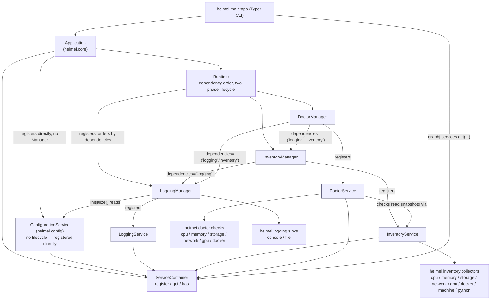
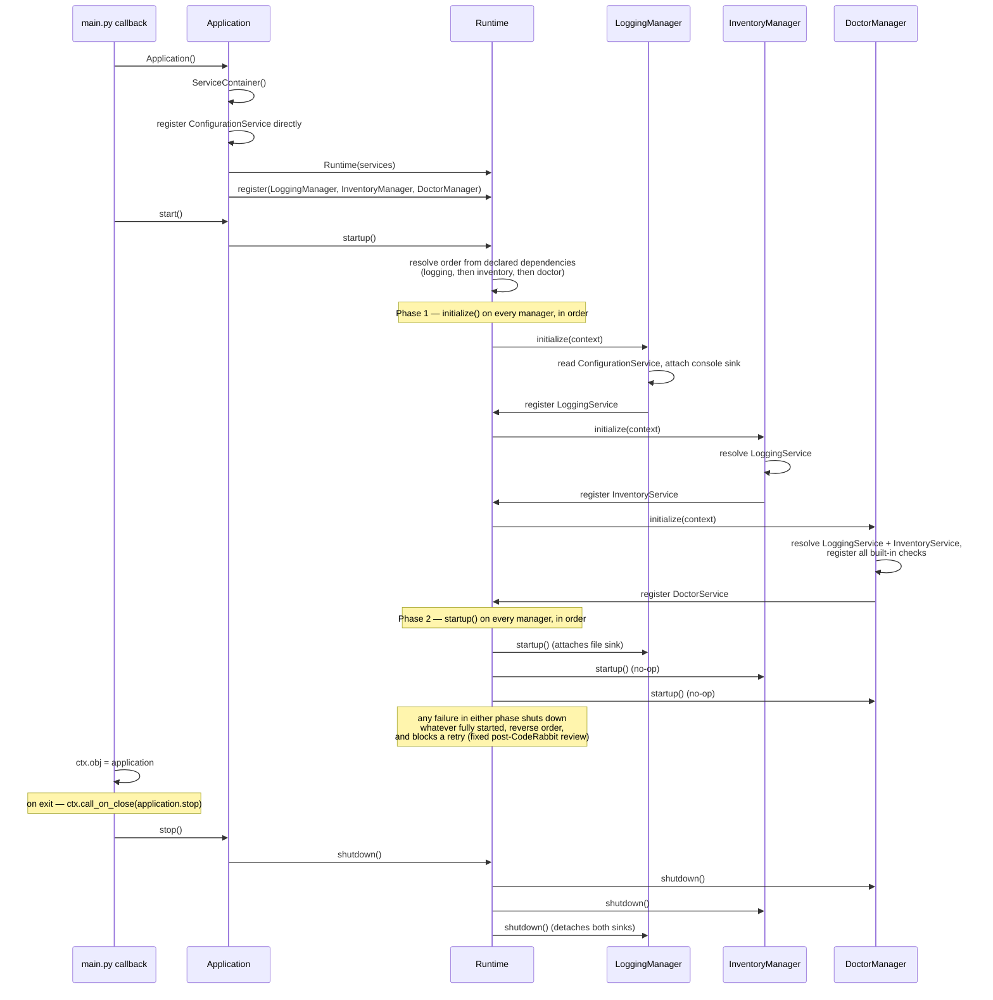

# Heimei CLI — Architecture

## Purpose

Current-state map of `Projects/Heimei` after Milestone M1: what the five implemented subsystems are, how they depend on each other, and how the process actually starts up. This is a snapshot of *what exists*, not a design discussion — architectural decisions and their rationale live in the ADRs linked above; this document only shows how those decisions compose together in the running system.

## Scope

`Projects/Heimei`'s Python package (`src/heimei`) as of the M1 milestone (Configuration, Core Runtime, Logging, Inventory, Doctor — all implemented, tested, and frozen). Does not cover the still-empty stub packages (`agents/`, `backup/`, `bootstrap/`, `memory/`, `models/`, `services/`, `status/`, `ui/`, `update/`, `utils/`, `workflows/`) beyond noting where they'd eventually plug in — see `docs/ROADMAP.md`.

## Component diagram

Every box marked as a frozen subsystem (blue fill) went through the propose → refine → approve → implement → freeze cycle and has an Accepted ADR. `Application`, `ServiceContainer`, and `Runtime` are Core Runtime (ADR-0011) — the orchestration layer every manager plugs into, itself frozen but drawn unshaded here since it's infrastructure rather than a "subsystem" with its own domain data.

## Startup sequence

Two details that are easy to miss reading the source in isolation:

- **`ConfigurationService` is not in the dependency graph at all.** It's registered into the `ServiceContainer` before `Runtime.startup()` even runs, so every manager's `initialize()` can resolve it unconditionally — `LoggingManager` does, despite declaring `dependencies=()`. Deliberate (Configuration is stateless and lazy per ADR-0008), but it means "declared dependencies" only govern *manager-provided* services, not Configuration.
- **The two-phase split is real, not cosmetic.** All three managers finish `initialize()` before any of them runs `startup()`. This matters because `initialize()` is wiring (resolve dependencies, register a service) while `startup()` is activation (open a file handle, start something running) — a manager can never observe another manager mid-startup.

## Subsystem responsibilities

| Package | Owns | Never does |
|---|---|---|
| `heimei.config` | Loading, validating, and caching manifest YAML into typed Pydantic models | Parse YAML outside `loader.py`; know about any specific manifest's shape |
| `heimei.core` | Manager lifecycle orchestration, service registration, dependency ordering | Business logic of any kind |
| `heimei.logging` | Structured logging, sink routing (console/file today) | Let anything outside `heimei.logging.sinks` touch `loguru` directly |
| `heimei.inventory` | Read-only live machine state, layered hardware/tooling discovery | Change system state, reconcile configuration, judge health |
| `heimei.doctor` | Evaluate Inventory snapshots into Findings via independent, composable checks | Query the OS directly, mutate anything |

## Where this diagram will need to change next

See `docs/ROADMAP.md` for the actual plan — noted here only so the two documents don't drift: a sixth manager, `Application` potentially moving into `heimei.bootstrap`, and a direct `heimei inventory` CLI command are the changes most likely to touch this diagram next.
